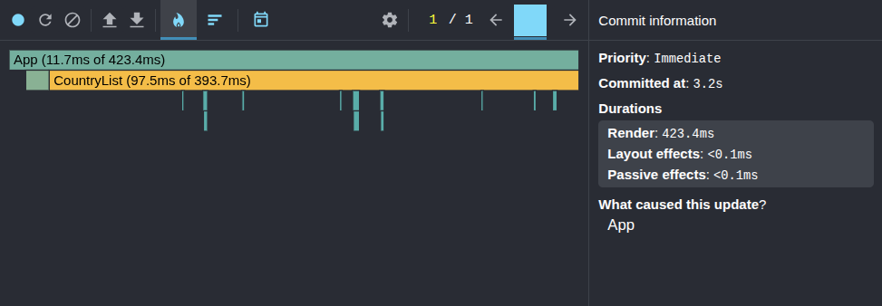
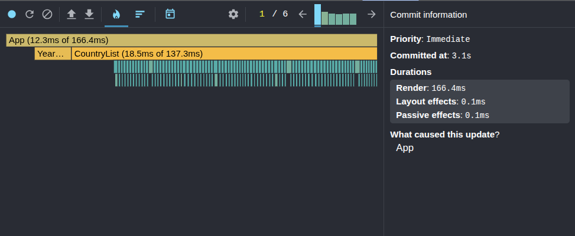
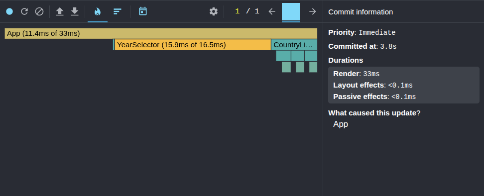
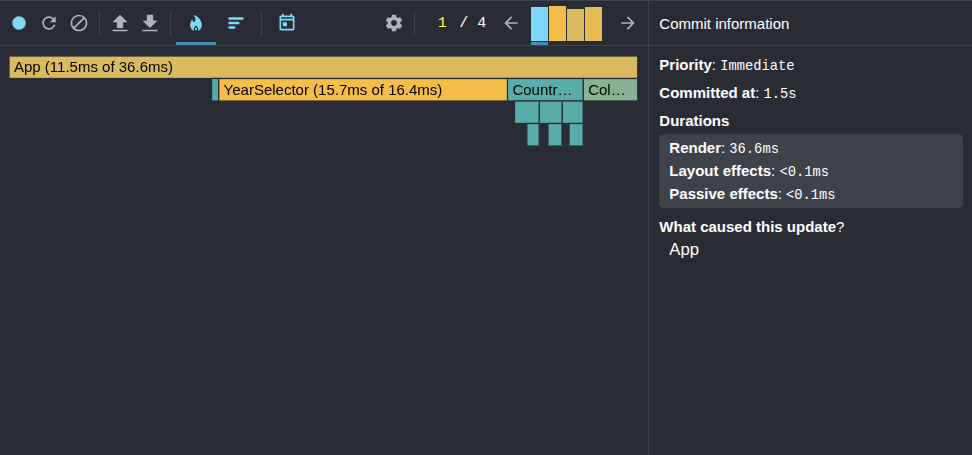

# Performance Optimization Report

## Baseline Measurements

### Interaction A: Sort countries

- **Commit duration**: 3.2s
- **Render duration**: 423.4ms
- **Screenshot**: 

### Interaction B: Search countries

- **Commit duration**: 3.1s
- **Render duration**: 166.4ms
- **Screenshot**: 

### Interaction C: Change year

- **Commit duration**: 3.8s
- **Render duration**: 33ms
- **Screenshot**: 

### Interaction D: Toggle column

- **Commit duration**: 1.5s
- **Render duration**: 36.6ms
- **Screenshot**: 
